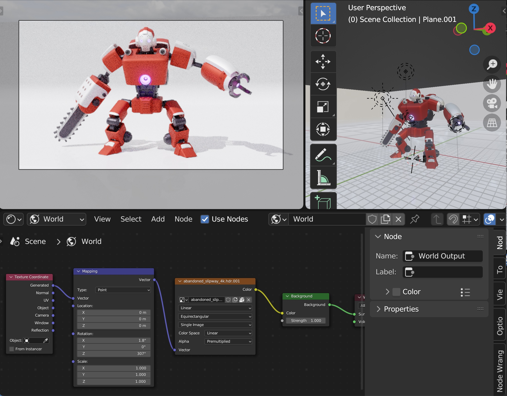
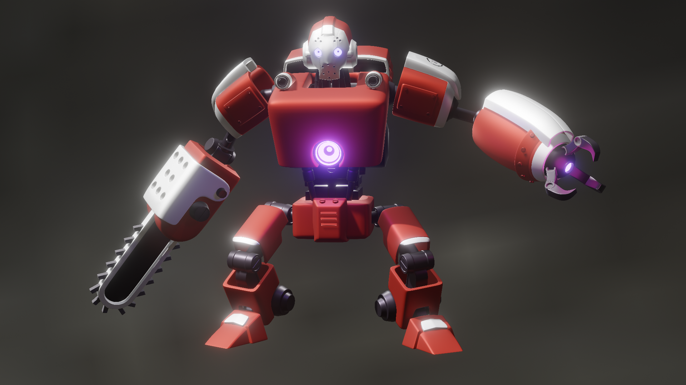

# Name of project

Blender simple robot

## Table of contents

- [Name of project](#name-of-project)
  - [Table of contents](#table-of-contents)
  - [General info](#general-info)
  - [Screenshots](#screenshots)
  - [Technologies](#technologies)
  - [Features](#features)
  - [Status](#status)
  - [Inspiration](#inspiration)
  - [Contact](#contact)

## General info

Hard surface tutorial's modeling exercise made in Blender

## Screenshots

## Technologies

- Blender 3.4.1

## Features

List of features:

- posed
- all the parts are separeted

## Status

Project is: _done_

## Inspiration

Project by Linkedin

## Contact

By bermarte
